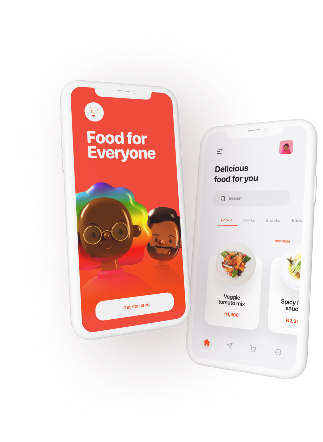

МИНИСТЕРСТВО НАУКИ И ВЫСШЕГО ОБРАЗОВАНИЯ

РОССИЙСКОЙ ФЕДЕРАЦИИ

ФЕДЕРАЛЬНОЕ ГОСУДАРСТВЕННОЕ БЮДЖЕТНОЕ ОБРАЗОВАТЕЛЬНОЕ УЧРЕЖДЕНИЕ ВЫСШЕГО ОБРАЗОВАНИЯ

«ВЯТСКИЙ ГОСУДАРСТВЕННЫЙ УНИВЕРСИТЕТ»

Институт математики и информационных систем

Факультет автоматики и вычислительной техники

Кафедра систем автоматизации управления

Дата сдачи на проверку:

«___» __________ 2021 г.

Проверено:

«___» __________ 2021 г.

Изучение основ языка JavaScript

Отчет по лабораторной работе № 4

по дисциплине

«Основы frontend-разработки и организации человеко-машинного интерфейса»

Вариант 3

Разработал студент гр. ИТб-1301-01-00 ________________ /Голованов О.А./

Проверил ст. преподаватель _________________ /Земцов М.А./

Работа защищена с оценкой	«___________» «___» __________ 2021 г.

Киров 2021

Цель лабораторной работы: изучить основы языка JavaScript.

Задачи:

1. Изучить основные элементы и подходы к программированию в JavaScript
2. Изучить подходы к работе JavaScript в браузере
3. Выполнить верстку макета по заданию преподавателя
4. Составить отчет по выполненным задачам
5. Защитить лабораторную работу

Ход выполнения:

1. Изучить основные элементы и подходы к программированию в JavaScript

Перед выполнением лаборной работы была изучена документация по ООЯП - JavaScript, а конкретно следующие разделы:

* Введение в язык программирования;
* Основания для стандартизации;
* Структуры кода;
* Переменные;
* Типы данных;
* Преобразование типов;
* Базовые операторы;
* Операторы сравнения;
* Конструкции ветвления;
* Функции;
* Объекты;
* Работы с объектами;
* Тип данных Symbol;

При проведении аналогии с языком C# было выявлено большое сходство. Данные объектно языки программирования отличаются методами и имеют небольшую разницу в синтаксисе.

2. Изучить подходы к работе JavaScript в браузере

В ходе работы были изучены такие понятия как DOM-дерево, события и их типы, формы.

3. Выполнить верстку макета по заданию преподавателя

Для работы над лабораторной работой и сохранения всех результатов, в репозитории “Basic frontend dev labs” создана ветвь “lab4” от стартового коммита главной ветви.

При вычислении варианта задания был получен 3 вариант работы.

Так как данный макет необходимо реализовать с применением библиотеки tailwind, был установлен помощник редактора кода.

Для начала работы с данным помощником применено официальное руководство пользования и к шаблону подключена библиотека.

Выполненная верстка представлена на рисунке 1.

Рисунок 1 - Верстка страницы

HTML-страница провалидирована и представлена ниже в листинге А.

*Задание:* К полученной странице необходимо добавить на все кнопки интерактивное сообщение 
Я это сделал, а @UserName тебе от меня совет: “ Поступай правильно — поступай в ВятГУ!”.
Вывод сообщения должен производится для вариантов 1 и 5 в виде promt, 2-3 в виде модального окна, а 4 и 6 - в форме всплывающего уведомления. Ввод @UserName обязателен при первом выводе окна. Последующие выводы сообщений не должны требовать ввода @UserName.

Выполненное задание представлено ниже на рисунках 2 и 3.

Рисунок 2 - Уведомление с вводом

Рисунок 3 - Уведомление без вывода

Пошаговая инструкция создания проекта:

1. Реализация HTML разметки.
2. Подключение CSS стилей.
3. Добавление JavaScript событий для кнопок.
4. Составить отчет по выполненным задачам

Вывод: в ходе работы были закреплены навыки cтилизации и трансформации элементов через CSS. Приобретены знания и навыки по работе с Tailwind. Также была изучена теоритическая информация про ООЯП - JavaScript, которая в ходе работы была закреплена на практике. Полный список изученной документации приведен в приложении Б.

Приложение А

(обязательное) 

Листинг страницы 

 <!DOCTYPE html>
<html lang="ru">
  <head>
    <title>Голованов Олег Алексеевич</title>
    <link href="css.css" rel="stylesheet">
    
    
    
    <link href="https://unpkg.com/tailwindcss@^1.0/dist/tailwind.min.css" rel="stylesheet"/>
    
  </head>
  <body>
    <header class="flex mx-auto justify-between container">
        
        

				  <button id="nav-toggle" class="flex items-center px-3 py-2 text-gray-500 border rounded border-gray-600 hover:text-gray-900 hover:border-green-500 focus:outline-none appearance-none">
					  <svg class="fill-current h-3 w-3">
						  <title>Menue</title>
						  <path d="M0 3h20v2H0V3zm0 6h20v2H0V9zm0 6h20v2H0v-2z" />
					  </svg>
				  </button>
        

        

          <ul class="list-reset lg:flex justify-end flex-1 items-center ">
            <li class="mr-3">
            
Home
 
            </li>
            <li class="mr-3">
              
Product

            </li>
            <li class="mr-3">
              
Faq

            </li>
            <li class="mr-3">
              
Contact

            </li>
          </ul>
        

    </header>
    <main>
        

          <section class=" mx-auto container px-8">
            
Food app
  
            
Why stay hungry when you can order form Bella Onojie

            
Download the bella onoje's food app now on

            <section class="text-center px-3 lg:px-0">
              <button class=" mt-4 bg-red-400 rounded-full text-white py-3 px-20 focus:outline-none" onclick="button()"> Playstore</button>
              <button class=" mt-4 border-2 border-red-400 lg:border-white rounded-full lg:text-white text-red-400 py-3 px-20 focus:outline-none" onclick="button()"> App store</button>
            </section>
          </section>
        

        <section class=" ">
            
            

        </section>
          
How the app works

          

        

          

            <section class="col-span-5"> 
              
            </section>
            

              
Create an account

              
Create/login to an existing account to get started

              
An account is created with your email and a desired password

              

              
 
                
              

          

        

        

            

              

                
Explore varieties

                
Sop for your favorites meals as e dey hot.

                
Shop for your favorite meals or drinks and enjoy while doing it.
    
              

              
 
                
              

            

          

        

          

            
 
              
            

            

              
Checkout

              
When you done check out and get it delivered.

              
When you done check out and get it delivered with esase.

              

              
 
                
              

          

        

          

            <section class="mx-auto container px-8 ">
              
Download the app now on

              
Available on your favorite store. Start your premium experience now

           </section>
           

            <button class="bg-red-400 text-white rounded-lg py-3 px-8 mt-16 focus:outline-none" onclick="button()"> Playmarket</button>
            <button class="text-white rounded-lg py-3 px-16 mt-16 focus:outline-none border-2" onclick="button()"> Appstore</button>
          

          

    </main>
    <footer class = "m-4" >
        

            
            
            
Copyright 2020 Bella Onojie.com

        

        
Copyright 2020 Bella Onojie.com
 
    </footer>
  </body>
</html>

Приложение Б

(справочное)

Библиографический список

1. <https://learn.javascript.ru/>
2. <https://tailwindcss.com/>
3. <https://marketplace.visualstudio.com/items?itemName=bradlc.vscode-tailwindcss>